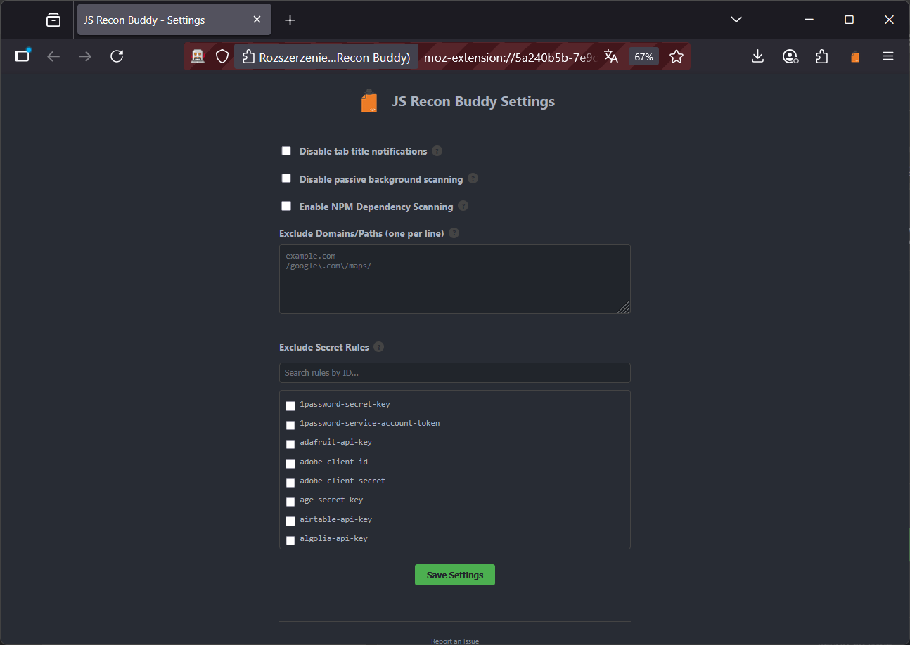

<p align="center">
    
</p>
<p align="center">
    <strong>JS Recon Buddy</strong>
</p>


<p align="center">
    <a href="#chromium-based-browser">
        
    </a>
    <a href="#firefox">
        
    </a>
    <a href="manifest.json">
        
    </a>
</p>

<p align="center">
    <a href="https://github.com/TheArqsz/JSRecon-Buddy/actions/workflows/ci.yml">
        
    </a>
</p>


A simple browser extension to quickly find interesting security-related information on a webpage. It injects an overlay to display its findings without interrupting your workflow.

## Table of Contents

- [Features](#features)
- [What it finds?](#what-it-finds)
- [Why this exists?](#why-this-exists)
- [Examples](#examples)
- [Browser Compatibility](#browser-compatibility)
  - [A Note for Chromium-based Users (Known Issue)](#a-note-for-chromium-based-users-known-issue)
- [How to Install or Update?](#how-to-install-or-update)
  - [Chromium-based browser](#chromium-based-browser)
  - [Firefox](#firefox)
- [How to use?](#how-to-use)
  - [Master On/Off Toggle](#master-onoff-toggle)
  - [Main usage (on-demand scan)](#main-usage-on-demand-scan)
  - [Passive secret scanning](#passive-secret-scanning)
  - [Source maps deconstruction](#source-maps-deconstruction)
- [Options and customization](#options-and-customization)
  - [Available Settings](#available-settings)
- [Automatic version check](#automatic-version-check)
- [Contributing](#contributing)
- [License](#license)
- [Acknowledgments](#acknowledgments)
- [Disclaimer](#disclaimer)

## Features

- On-Page Overlay - all results are displayed in an overlay directly on the page you're testing.
- Comprehensive Scan - analyzes inline scripts, external JavaScript files, and the main HTML document.
- Categorized Findings - organizes results into logical categories for clear and easy analysis.
- Interactive Results - easily copy individual sections or export all findings to a JSON file for further use.

## What it finds?

The scanner uses a set of regex patterns to identify and categorize potential security-related information:

- Subdomains - discovers related subdomains within the code.
- Endpoints & Paths - uncovers potential API endpoints and other useful paths. For **Next.js** applications, it also automatically parses (*if possible*) the build manifest to discover all client-side routes.
- Potential Secrets - scans for API keys, tokens, and other sensitive data using pattern matching and Shannon entropy checks.
- Potential DOM XSS Sinks - identifies dangerous properties and functions like .innerHTML and document.write.

| Sink / Keyword | Category | Finding Example |
| :--- | :--- | :--- |
| **`after`** | Library (jQuery) | `$('#msg').after(new URLSearchParams(location.search).get('userHtml'));` |
| **`append`** | Library (jQuery) | `$('#comments').append(new URLSearchParams(location.search).get('comment'));`|
| **`assign`** | URL/Location | `location.assign(new URLSearchParams(location.search).get('redirect'));` |
| **`before`** | Library (jQuery) | `$('#ad').before(new URLSearchParams(location.search).get('adContent'));` |
| **`cssText`** | Attribute/Style | `el.style.cssText = new URLSearchParams(location.search).get('css');` |
| **`eval`** | Execution | `eval("var config = " + new URLSearchParams(location.search).get('cfg'));` |
| **`html`** | Library (jQuery) | `$('#profile').html(new URLSearchParams(location.search).get('bio'));` |
| **`href`** | URL/Location | `link.href = new URLSearchParams(location.search).get('url');` |
| **`innerHTML`** | HTML/DOM | `div.innerHTML = location.hash.substring(1);` |
| **`insertAdjacentHTML`** | HTML/DOM | `div.insertAdjacentHTML('afterbegin', document.cookie);` |
| **`open`** | URL/Location | `window.open(new URLSearchParams(location.search).get('popupUrl'));` |
| **`outerHTML`** | HTML/DOM | `el.outerHTML = new URLSearchParams(location.search).get('widget');` |
| **`parseHTML`** | Library (jQuery) | `$.parseHTML(new URLSearchParams(location.search).get('content'));` |
| **`prepend`** | Library (jQuery) | `$('#list').prepend(new URLSearchParams(location.search).get('newItem'));` |
| **`replace`** | URL/Location | `location.replace(new URLSearchParams(location.search).get('path'));` |
| **`setAttribute`** | Attribute/Event | `el.setAttribute('onerror', new URLSearchParams(location.search).get('err'));` |
| **`setInterval`** | Execution | `setInterval("checkStatus('" + document.cookie + "')");` |
| **`setTimeout`** | Execution | `setTimeout("alert('" + new URLSearchParams(location.search).get('msg') + "')");` |
| **`src`** | URL/Location | `iframe.src = new URLSearchParams(location.search).get('page');` |
| **`style`** | Attribute/Style | `el.style = new URLSearchParams(location.search).get('styles');` |
| **`write`** | HTML/DOM | `document.write("Welcome " + new URLSearchParams(location.search).get('name'));`|
| **`writeln`** | HTML/DOM | `document.writeln(new URLSearchParams(location.search).get('line'));` |

- Potential Dependency Confusion - (**opt-in**) identifies private NPM packages that are not on the public registry, flagging a potential dependency confusion attack vector.

> [!TIP]
> You can test this feature by cloning this repository, opening the `assets/dependency-confusion-test/index.html` file in your browser, and running an on-demand scan.

- Interesting Parameters - flags potentially vulnerable URL parameters (e.g., redirect, debug, url).
- Source Maps - finds links to source maps which can expose original source code. Can optionally guess the location of source maps for discovered JavaScript files even if they aren't explicitly linked.

> [!NOTE]
> If it is a valid source map, the extension tries to deconstruct source files based on data there

- JS Libraries - lists identified JavaScript libraries and their versions.
- External and Inline Scripts - provides a complete inventory of all JavaScript sources loaded by the page, allowing you to view the content of any script in a formatted viewer.


## Why this exists?

This project was inspired by the simple yet powerful JavaScript bookmarklets popular in the bug bounty community, such as:

- https://x.com/grumpzsux/status/1830317635629949134
- https://x.com/Evan_Connelly/status/1830407433480450318
- https://github.com/0dayCTF/endlets
- ...and more iterations of the similar nature

While those are great for a quick look, they have a few key limitations:

- Modifying a bookmarklet to add new patterns or change its functionality is a pain.
- Most are hardcoded to find specific things, like just endpoints. Adding new scanners for secrets or parameters isn't straightforward.
- CORS...Bookmarklets [have hard time analyzing](https://medium.com/making-instapaper/bookmarklets-are-dead-d470d4bbb626) scripts from other domains, leaving major blind spots.

Another major inspiration was the original [TruffleHog Chrome Extension](https://github.com/trufflesecurity/Trufflehog-Chrome-Extension). While it was a great concept, it always annoyed me with its intrusive popups for every finding, and it hasn't been maintained for the last 4 years. I am also a huge fan of Gitleaks and use it in my projects, so I thought, why not combine these ideas?

JS Recon Buddy was built to solve these problems. It takes the great idea of a recon bookmarklet and a browser-based secret scanner and makes them more powerful and customizable.

## Examples

- Extension's popup
<p align="center">
	
</p>

- First scan of a given website
<p align="center">
	
</p>

- Cached results of a given website
<p align="center">
	
</p>

- New version is available on Github
<p align="center">
	
</p>

- Extension found secrets in the background
<p align="center">
	
</p>

- Deconstructed source map
<p align="center">
	
</p>

## Browser Compatibility

> **TL;DR**: This extension is built for Chromium-based browsers (Chrome, Brave, Edge) and also works on Firefox. However Chromium will always be the top priority, unless it says otherwise here.

This extension was primarily developed and tested on **Chromium-based** browsers, including Google Chrome, Brave, and Microsoft Edge. The core functionality is optimized for this environment, ensuring the most stable and reliable experience.

While cross-browser support for **Mozilla Firefox** [has been implemented](https://github.com/TheArqsz/JSRecon-Buddy/commit/a3d347c2e48b0d138ce8473ce188252da99cd05c), please be aware that the primary development focus remains on the Chromium family. Consequently, I reserve the right to deprecate or remove Firefox support in the future if its maintenance introduces significant bugs or compromises the extension's stability on its main platforms.

### A Note for Chromium-based Users (Known Issue)

When you load the extension as an unpacked extension in a Chromium-based browser, you may see a non-critical error in the chrome://extensions page that says:

```
'background.scripts' requires manifest version 2 or lower.
```

**You can safely ignore this message.**

This is an expected and harmless side effect of maintaining a single codebase for both Chromium and Firefox. To ensure Firefox compatibility (due to its current limitations with Manifest V3), a background script is declared in a way that modern Chromium browsers flag as outdated. To the best of [my knowledge](https://developer.mozilla.org/en-US/docs/Mozilla/Add-ons/WebExtensions/manifest.json/background#browser_support), this does not affect the extension's performance or functionality in any way.

This approach was chosen to avoid maintaining two separate versions of the extension. For the technically curious, you can read more about the underlying issue [in the mozilla/web-ext repository thread](https://github.com/mozilla/web-ext/issues/2532).

## How to Install or Update?

### Chromium-based browser

While I strongly advice for this extension to be loaded as an unpacked extension in developer mode, it can be installed [directly from the Chrome Web Store](https://chromewebstore.google.com/detail/emihdlmaomlajmkaanockgjhojehafnp).

However, if you decide to do it manually, here are the steps:

1. Download [ZIP from releases](https://github.com/TheArqsz/JSRecon-Buddy/releases/latest/download/js-recon-buddy.zip) or clone this repository to your local machine.

   > If downloaded as a file, unzip it to a directory called e.g. `js-recon-buddy`.
3. Open Google Chrome (or other chromium-based browser) and navigate to chrome://extensions.
4. Turn on "Developer mode" using the toggle in the top-right corner.
5. Click the "Load unpacked" button.
6. Select the directory where you cloned the repository or unzipped the archive.

The extension will now be installed or updated.

### Firefox

You can follow a similar path for the Chromium-based browser. The debug URL is [`about:debugging#/runtime/this-firefox`](about:debugging#/runtime/this-firefox). Fortunately, the Mozilla Add-on Store has fewer restrictions than the Chrome Web Store.

You can find my extension [here in the official Add-on Store](https://addons.mozilla.org/en-US/firefox/addon/js-recon-buddy/). Just click *Add to Firefox* and have fun.

## How to use?

### Master On/Off Toggle

A master `On/Off` switch is available in the top-right corner of the popup. When turned off, the extension will completely suspend all scanning functions (both passive and on-demand) until it is turned back on.

### Main usage (on-demand scan)

1. Navigate to the target website.
2. Click the extension icon in your browser's toolbar.
4. Press 'Analyze full page'
5. An overlay will appear and automatically start scanning the page.
    - If you've analyzed this page before, it will instantly show the cached results (indicated in the top-left corner) while a new scan runs.
    - You can rescan the page again if you want
7. Review the categorized findings!

### Passive secret scanning

In addition to the on-demand full analysis, JS Recon Buddy automatically performs a passive scan for secrets on every page you visit. This feature is designed to provide at-a-glance awareness of potential secret leaks without any user interaction. The results of this background scan are reflected directly in the extension's toolbar icon. This entire process happens within your browser using only the regular expressions bundled with the extension - **no findings** or **page data** are ever sent to an external server.

#### Icon Status Indicators

The extension icon changes color and uses a small badge (the notification on the corner) to communicate the status of the passive scan in real-time.

By clicking the icon, you can open the popup to view a detailed list of these passively found secrets and inspect their source, all without needing to run the full page analysis. This ensures you never miss a potential finding while browsing.

- **Scanning (Yellow)** - when a page is loading, the icon turns yellow with a "..." badge, indicating that the passive scan is in progress.

> If the icon is yellow, without the indicator, it means that the webpage cannot be scanned or there was an error within the extension

<p align="center">
	
</p>

- **No Secrets Found (Green)** - once the scan is complete, a green icon means that no secrets were found in the page's HTML or scripts, based on our rules.

<p align="center">
	
</p>

- **Secrets Found (Red)** - the icon turns red and displays a badge with a number, showing exactly how many potential secrets were discovered.

<p align="center">
	
</p>

### Source maps deconstruction

If you want to view deconstructed source files, click on the Source Map entry, then on the url. What you will see, is the source code as available in the source map itself.

<p align="center">
	
</p>

## Options and customization

You can customize the extension's behavior by opening the settings page. Access it by clicking the settings icon in the bottom-right corner of the extension's popup.

<p align="center">
	
</p>

<p align="center">
	
</p>

### Available Settings

- Disable tab title notifications - by default, the extension adds a `[JSRB (x)]` prefix to the page title when findings are discovered. Check this box to turn off this feature for a cleaner look.

- Disable passive background scanning - prevents the extension from automatically scanning pages on load. This does not affect the on-demand "Analyze Full Page" scan.

- Enable NPM Dependency Scanning - an opt-in feature for the on-demand scan. When enabled, the scanner will check for private NPM packages that could be vulnerable to dependency confusion.

> [!WARNING]
> This makes requests to a public NPM registry.

- Enable Source Map Guessing - an opt-in feature for the on-demand scan. When enabled, the extension attempts to find source maps by appending `.map` to the URL of every discovered JavaScript file (e.g. `script.js` -> `script.js.map`). Useful for finding maps that developers forgot to remove but didn't link.

- Exclude Domains/Paths - this feature allows you to prevent the extension from scanning specific websites. You can add one entry per line:

    - Simple Match - entering `example.com` will prevent scans on any URL containing that string.
    - Regular Expression - for more complex rules, you can use regular expressions by enclosing the pattern in slashes, like `/google\.com\/maps/`.

- Exclude Secret Rules - a searchable list that allows you to disable specific secret-finding rules. This is useful for reducing noise from patterns that are not relevant to your current target.

When a page is excluded from scanning, the extension icon will remain unchanged, and no analysis will be performed, as shown below for `example.com`.

<p align="center">
	
</p>

## Automatic version check

The extension automatically checks for new versions. When you open the popup, it compares its own version against the [manifest.json](manifest.json) file in this GitHub repository. To avoid excessive requests, the latest version number is cached for 6 hours. If a newer version is available on GitHub, an asterisk will appear on the GitHub logo in the popup.

<p align="center">
	
</p>

## Contributing

Contributions are welcome! Whether it's a bug report, a feature request, or a pull request, all help is appreciated - get started [here](CONTRIBUTING.md).

## License

This project is licensed under the MIT License - see the [LICENSE](LICENSE) file for details.

## Acknowledgments

The secret detection patterns in [rules.js](src/utils/rules.js) were heavily inspired by [the comprehensive rule set](https://github.com/gitleaks/gitleaks/blob/master/config/gitleaks.toml) from the fantastic open-source project, Gitleaks, which I've adapted and expanded upon. A big thanks to the Gitleaks creators and contributors for providing such a great foundation, which is distributed under the MIT License.

A special thanks goes to the many security researchers in the bug bounty community whose clever JavaScript bookmarklets were the original inspiration for this extension and to the creators of the original [TruffleHog Chrome Extension](https://github.com/trufflesecurity/Trufflehog-Chrome-Extension).

## Disclaimer

This tool is intended for **educational** and **authorized** security testing purposes only. Do not use this tool on any system or website for which you do not have explicit, prior authorization. The author accepts no liability and is not responsible for any misuse or damage caused by this program. Use at your own risk.
